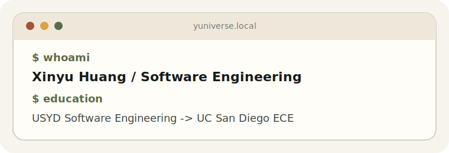

# 黄新宇 / Xinyu Huang

 

本科：University of Sydney, Software Engineering

研究生：University of California, San Diego, Electrical and Computer Engineering

 

<a href="https://www.xinyuhuang.space/">Personal Site</a>
 ·
<a href="mailto:xinyuhimself@gmail.com">xinyuhimself@gmail.com</a>
 ·
13567277836

 
 

